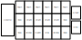

# Play Area
The main game board is a 6x6 grid of zones. Each player has a 6x3 play area for deploying their `pieces`. `pieces` may only be deployed to the corresponding `deploy` zone. There are additional `hospital`, `grave`, and `deck` zones.

